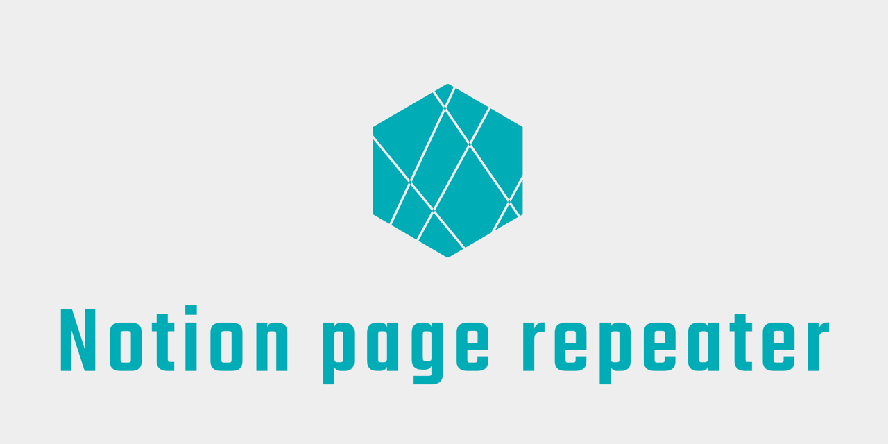

# notion-page-repeater

<div style="text-align: center;">



</div>

## Documents
- [Sequence](./docs/uml.md)
- [japanese docs](docs/jp.md)

## What you can do🙆‍♂️

- You can copy the properties of a template page.
  - You can set up participants, tags, and other settings automatically.
- You can create pages on a daily or weekly basis.
  - You can create pages based on the frequency of your meetings.

## What you can't do🙅‍♂️

- The contents of the template page cannot be copied.
  - Only properties can be copied.
  - Select a template page from the pages created each time and pour in the template.
- Cannot skip holidays.
  - We'll deal with it soon.
- We look forward to your contributions😉

## How to use

**Notion side settings**

1. Duplicate the Settings page.
    1. https://tosite.notion.site/d9e882ac654a444ba550be32f8cdfd29
2. Issue a Notion API token.
    1. https://www.notion.so/my-integrations
3. Add a Datetime column to the properties of the page you want to auto-generate.
4. Create a template page for the page you want to auto-generate.
5. Put the ID of the template page in the column of the Settings page.
6. Set permissions from the API for the Settings page and the parent page you want to auto-generate.

**GitHub side settings**

7. Put Notion API key in `NOTION_TOKEN` of GitHub secret.
8. Put the ID of the Settings page in the `SETTING_DB_ID` of the GitHub Actions yml.
9. put the Slack Webhook URL in the `SLACK_WEBHOOK_URL` of the GitHub secret.

**GitHub Actions side settings**

10. Configure GitHub Actions.

```yml  
name: Notion Page Repeater Demo
on:
  push:
    branches:
      - main
  schedule:
    - cron: '00 * * * *'

jobs:
  sync:
    name: Notion Page Repeater
    runs-on: ubuntu-latest
    container: node:latest
    env:
      TZ: Asia/Tokyo
      LANG: ja_JP.UTF-8
    steps:
      - name: Sync
        env:
          NOTION_TOKEN: ${{ secrets.NOTION_TOKEN }}
          SLACK_WEBHOOK_URL: ${{ secrets.SLACK_WEBHOOK_URL }}
          SETTING_DB_ID: ${{ secrets.SETTING_DB_ID }}
        run: |
          yarn add notion-page-repeater
          npx notion-page-repeater
```

## Pages information

### Settings page

A page to manage the settings for automatic generation.

#### Columns

|column name|type|required|description|value|
| --- | --- | --- | --- | --- |
| title | Title | * | Used for the title of the page | - |
| template_id | Text | * | ID of the page duplicator | - |
| enable | Checkbox | * | To be processed when checking | - |
| interval | Select | * | run interval | daily, weekly |
| week | Select | * (interval=weekly) | Day of the week | Sun, Mon, Tue, Wed, Thu, Fri, Sat |
| hour | Number | - | Opening time(hour) | - |
| minute | Number | - | Opening time(minute) | - |
| previous_id | Text | - | Previous page ID (used by the system) | - |

### Template pages

A page that holds the properties of automatically generated pages.  
The template page ID is held in the configuration page.  
The page is automatically generated based on the properties of the template page.  
Note that the Datetime column is required.

### Columns

|column name|type|required|description|value|
| --- | --- | --- | --- | --- |
| Datetime | Date | * | Opening time | - |
