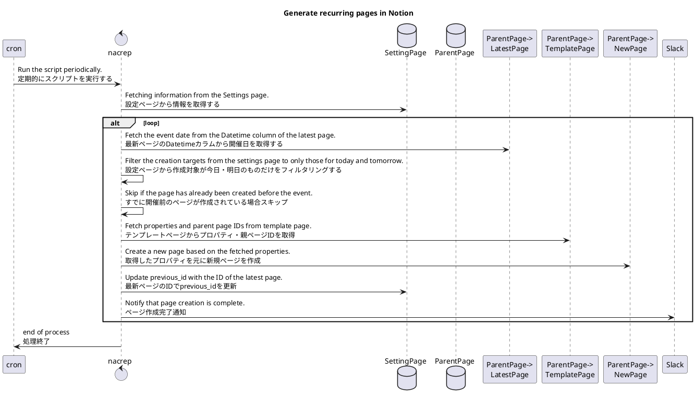
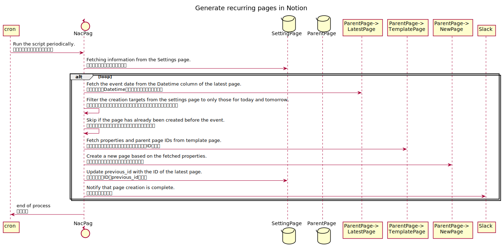

# NacPag - Notion Automatically Create Pages

## What you can do🙆‍♂️

- テンプレートページのプロパティのコピー
  - 参加者やタグ、その他諸々の設定を自動で設定できます
- 日次・週次でページを作成
  - ミーティングの頻度に合わせてページを作成できます

## What you can't do🙅‍♂️

- テンプレートページの中身をコピー
  - コピーできるのはプロパティのみです
  - 毎回作成されたページからテンプレートページを選択して雛形を流し込んでください
- 祝日のスキップ
  - そのうち対応します
- Settingsページの自動生成
  - 初回のみ必要なカラム・値を手動で生成してください
- We look forward to your contributions😉

## How to use

**Notion側の設定**
1. Settingsページを複製する
   1. https://tosite.notion.site/d9e882ac654a444ba550be32f8cdfd29?v=4d30c5a1ba1f4974a0d099044b5a4745
2. APIトークンを発行する
   1. https://www.notion.so/my-integrations
3. 自動生成したいページのプロパティにDatetimeカラムを追加する
4. 自動生成したいページのテンプレートページを作成する
5. テンプレートページのIDをSettingsページのカラムに記載する
6. Settingsページ・自動生成したい親ページにAPIからのアクセス許可設定を行う

**nacrep側の設定**
7. APIキーを `.env` の `NOTION_TOKEN` に記載する
8. SettingsページのIDを `.env` の `SETTING_DB_ID` に記載する
9. Slack Webhook URLを `.env` の `SLACK_WEBHOOK_URL` に記載する

**cronの設定**
10. GitHubActionsもしくはサーバーのcron設定から定期的に `yarn run start` を実行する設定を行う
    1. GitHubActionsから実行する場合はxxxを参照のこと

## Sequence

uml

## Pages information

### Settings page

A page to manage the settings for automatic generation.

自動生成する際の設定を管理するページ。

#### Columns

|column name|type|required|description|value|
| --- | --- | --- | --- | --- |
| title | Title | * | Used for the title of the page ページのタイトルに使用 | - |
| template_id | Text | * | ID of the page duplicator ページ複製元のID | - |
| enable | Checkbox | * | To be processed when checking チェック時に処理対象となる | - |
| interval | Select | * | run interval 実行間隔 | daily, weekly |
| week | Select | * (interval=weekly) | Day of the week 開催曜日 | Sun, Mon, Tue, Wed, Thu, Fri, Sat |
| hour | Number | - | Opening time(hour) 開催時刻(時) | - |
| minute | Number | - | Opening time(minute) 開催時刻(分) | - |
| previous_id | Text | - | Previous page ID (used by the system) 前回ページID(システムで使用) | - |

### Template pages

A page that holds the properties of automatically generated pages.  
The template page ID is held in the configuration page.  
The page is automatically generated based on the properties of the template page.  
Note that the Datetime column is required.

自動で生成するページのプロパティを保持するページ。  
テンプレートページIDは設定ページに保持する。  
テンプレートページのプロパティを元にページを自動生成する。  
Datetimeカラムは必須となる点に留意。

### Columns

|column name|type|required|description|value|
| --- | --- | --- | --- | --- |
| Datetime | Date | * | Opening time 開催時刻 | - |
