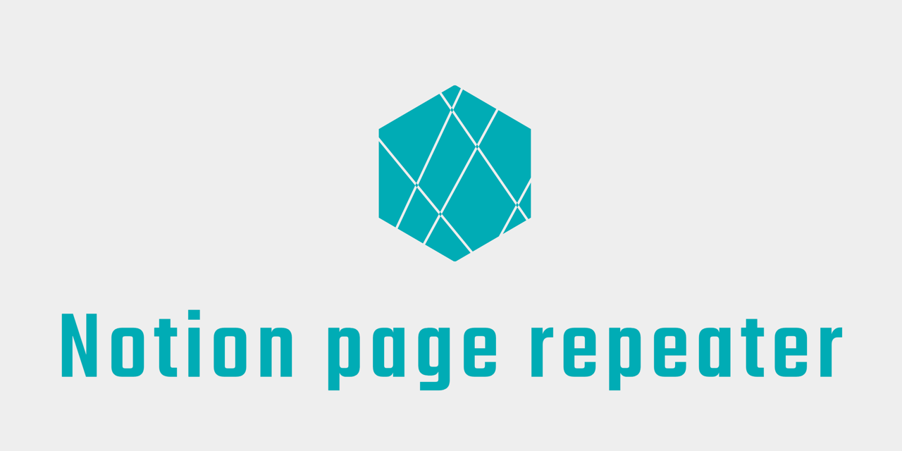

# notion-page-repeater

<div style="text-align: center;">



</div>

## Description
[Notion](https://www.notion.so/)のページを一定間隔で作成するGitHub Actionsです。
定例ミーティングなどの毎回使うページの作成を自動化できます。

### What you can do🙆‍♂️

- テンプレートページのプロパティのコピー
    - 参加者やタグ、その他諸々の設定を自動で設定できます
- 日次・週次でページを作成
    - ミーティングの頻度に合わせてページを作成できます

### What you can't do🙅‍♂️

- テンプレートページの中身をコピー
    - コピーできるのはプロパティのみです
    - 毎回作成されたページからテンプレートページを選択して雛形を流し込んでください
- 祝日のスキップ
    - そのうち対応します
- We look forward to your contributions😉

## Requirement

GitHub Actions

## Usage

**Notion側の設定**

1. Settingsページを複製する
    1. https://tosite.notion.site/d9e882ac654a444ba550be32f8cdfd29
2. Notion APIトークンを発行する
    1. https://www.notion.so/my-integrations
3. 自動生成したいページのプロパティにDatetimeカラムを追加する
4. 自動生成したいページのテンプレートページを作成する
5. テンプレートページのIDをSettingsページのカラムに記載する
6. Settingsページ・自動生成したい親ページにAPIからのアクセス許可設定を行う

**GitHub側の設定**

7. Notion APIキーをGitHubシークレットの `NOTION_TOKEN` に記載する
8. SettingsページのIDをGitHub Actionsのymlの `SETTING_DB_ID` に記載する
9. Slack Webhook URLをGitHubシークレットの `SLACK_WEBHOOK_URL` に記載する

**GitHub Actionsの設定**

10. GitHub Actionsの設定を行う

```yml  
name: Notion Page Repeater Demo
on:
  push:
    branches:
      - main
  schedule:
    - cron: '00 * * * *'

jobs:
  sync:
    name: Notion Page Repeater
    runs-on: ubuntu-latest
    container: node:latest
    env:
      TZ: Asia/Tokyo
      LANG: ja_JP.UTF-8
    steps:
      - name: Sync
        uses: tosite/notion-page-repeater@v1.0
        env:
          NOTION_TOKEN: ${{ secrets.NOTION_TOKEN }}
          SLACK_WEBHOOK_URL: ${{ secrets.SLACK_WEBHOOK_URL }}
          SETTING_DB_ID: ${{ secrets.SETTING_DB_ID }}
```

### Pages information

#### Settings page

自動生成する際の設定を管理するページ。

##### Columns

|column name|type|required|description|value|
| --- | --- | --- | --- | --- |
| title | Title | * | ページのタイトルに使用 | - |
| template_id | Text | * | ページ複製元のID | - |
| enable | Checkbox | * | チェック時に処理対象となる | - |
| interval | Select | * | 実行間隔 | daily, weekly |
| week | Select | * (interval=weekly) | 開催曜日 | Sun, Mon, Tue, Wed, Thu, Fri, Sat |
| hour | Number | - | 開催時刻(時) | - |
| minute | Number | - | 開催時刻(分) | - |
| previous_id | Text | - | 前回ページID(システムで使用) | - |

#### Template pages

自動で生成するページのプロパティを保持するページ。  
テンプレートページIDは設定ページに保持する。  
テンプレートページのプロパティを元にページを自動生成する。  
Datetimeカラムは必須となる点に留意。

#### Columns

|column name|type|required|description|value|
| --- | --- | --- | --- | --- |
| Datetime | Date | * | 開催時刻 | - |

## Licence

MIT

## Author

[tosite](https://github.com/tosite)
