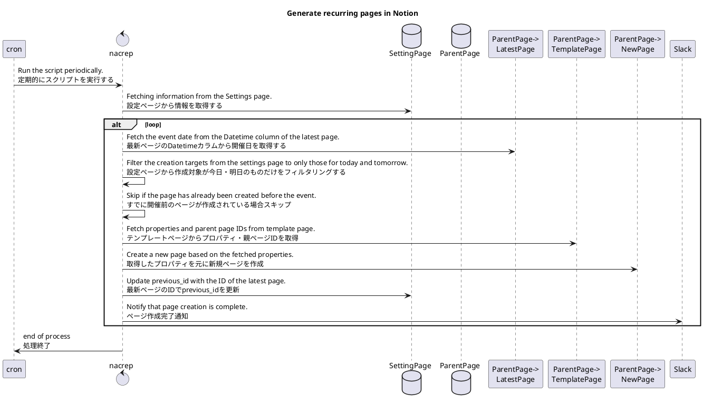

uml

```puml
@startuml
title Generate recurring pages in Notion

participant cron
control nacrep as s

database SettingPage as sp

database ParentPage as pp
participant "ParentPage->\nLatestPage" as lp
participant "ParentPage->\nTemplatePage" as tp
participant "ParentPage->\nNewPage" as np

participant Slack

cron->s: Run the script periodically. \n定期的にスクリプトを実行する
s->sp: Fetching information from the Settings page.\n設定ページから情報を取得する

alt loop
  s->lp: Fetch the event date from the Datetime column of the latest page.\n最新ページのDatetimeカラムから開催日を取得する
  s->s: Filter the creation targets from the settings page to only those for today and tomorrow.\n設定ページから作成対象が今日・明日のものだけをフィルタリングする
  s->s: Skip if the page has already been created before the event.\nすでに開催前のページが作成されている場合スキップ
  s->tp: Fetch properties and parent page IDs from template page.\nテンプレートページからプロパティ・親ページIDを取得
  s->np: Create a new page based on the fetched properties.\n取得したプロパティを元に新規ページを作成
  s->sp: Update previous_id with the ID of the latest page.\n最新ページのIDでprevious_idを更新
  s->Slack: Notify that page creation is complete.\nページ作成完了通知
end
s->cron:end of process\n処理終了
@enduml
```

